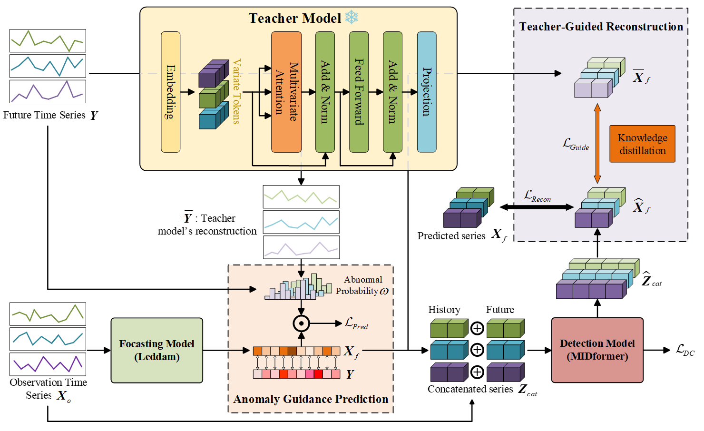

# TGAR

**此代码是我们论文《一种面向未来时间序列异常预测的教师指导异常感知与重构框架》的官方PyTorch实现。**

## 介绍
本文提出了一种教师指导的异常感知与重构（Teacher-Guided Anomaly-Aware and Reconstruction Framework，TGAR）框架，用于未来时间序列异常预测。该框架由异常感知预测模块（Anomaly-Aware Forecasting，AAF）和教师指导重构模块（Teacher-Guided Reconstruction，TGR）组成。两个模块协同作用，使模型能够在预测阶段捕捉异常征兆，并在检测阶段实现稳健的重构，从而实现对未来异常事件的前瞻性识别与高精度预测。


## 关键设计
🌟 **异常感知预测**: 利用教师模型对未来序列的重构误差生成时间维度上的异常权重，从而引导预测模型关注潜在的异常区域，增强对异常动态的感知能力。

🌟 **教师指导重构**: 通过教师模型的知识蒸馏，为检测阶段提供稳定的重构指导，缓解由预测误差引起的累积偏差。

🌟 **MIDformer**: 通过引入双重掩码注意力机制，结合变量内和变量间注意力，有效捕捉时间与变量间的依赖关系，从而精准定位异常关键区域，显著提升了异常检测的敏感性与精度。其整体架构如图所示：
<p align="center">
  
</p>

## 快速开始

### 环境安装

在已具备Python环境的前提下（注意：本项目已在Python 3.8环境下完成全面测试），请通过以下命令安装依赖项:

```
pip install -r requirements.txt
```

### 数据集下载
您可以从[CATCH](https://github.com/decisionintelligence/CATCH)处下载全部数据集（下载可能需要一些时间，请耐心等待。）然后将下载的数据放置在./dataset/data文件夹下。

### 模型训练与评估
您可以通过下面的方式直接复现实验结果：
```
python run.py --data MSL --data_path MSL.csv --c_in 55
```

## 结果

在五个常用数据集上的综合实验表明，本文提出的TGAR方法在绝大多数场景下显著优于现有模型，尤其在GECCO和SMAP数据集上分别取得了约20%和9%的性能提升。相比线性模型波动大、传统预测模型弱化异常信号的局限性，TGAR方法通过教师模型的异常感知机制、MIDformer的双注意力架构及知识蒸馏技术，实现了对异常特征的多维度捕捉，显著提升了模型在检测性能、稳定性和泛化能力方面的综合表现。


## 致谢

我们由衷感谢以下 GitHub 仓库提供的重要代码库和数据集：

https://github.com/yuqinie98/PatchTST

https://github.com/Levi-Ackman/Leddam

https://github.com/decisionintelligence/CATCH


